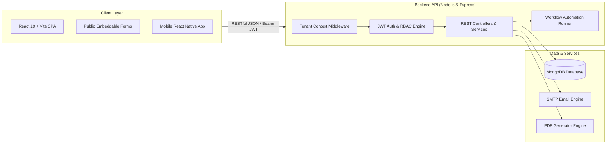

<div align="center">

# 🚀 NexCRM Enterprise
### The Modern, Multi-Tenant Open-Source Business CRM & Sales Lifecycle Platform

[](https://opensource.org/licenses/MIT)
[](CONTRIBUTING.md)
[](https://nodejs.org/)
[](https://react.dev/)
[](https://www.mongodb.com/)
[](https://expressjs.com/)
[](https://vitejs.dev/)

**A complete, production-ready, self-hosted alternative to expensive proprietary CRMs like Salesforce and HubSpot.**  
Designed for fast-growing startups, agencies, consultancies, and modern sales teams.

[Features](#-key-features) • [Quick Start](#-quick-start) • [Role Credentials](#-pre-seeded-demo-credentials) • [Tech Stack](#-technology-stack) • [Architecture](#-high-level-architecture) • [Contributing](#-contributing)

</div>

---

## 🌟 Why NexCRM?

Commercial CRM software often charges **$50 to $200 per user/month**, locking critical customer data and business analytics behind paywalls.

**NexCRM Enterprise** gives you full control over your customer relationships, sales pipelines, quotations, invoices, and automations with **zero licensing fees** and **complete data sovereignty**.

---

## ⚡ Key Features

### 1. 📥 Inbound Lead Capture & Automated Scoring
- **Multiple Ingestion Channels:** Public embeddable web forms (`/lead-capture`), webhook endpoints, and bulk CSV/Excel import.
- **Smart Lead Scoring (0–100 Algorithm):** Automatically evaluates contact completeness, corporate emails, and purchase intent into ❄️ *Cold*, 🌤️ *Warm*, 🔥 *Hot*, and ⚡ *Very Hot* tiers.
- **Automated Routing:** Round-robin or load-balanced distribution across sales representatives.
- **1-Click Atomic Conversion:** Converts qualified leads into a **Customer Profile + Contact Person + Active Deal** in a single atomic transaction.

### 2. 📊 Interactive Kanban Deal Pipelines
- **Visual Drag-and-Drop Pipeline:** Move deals across customized stages (*Discovery ➔ Demo ➔ Proposal ➔ Negotiation ➔ Closed Won/Lost*).
- **Weighted Forecasts:** Calculates real-time pipeline valuation using stage-specific win probabilities.
- **Multi-Pipeline Support:** Easily switch between different pipelines (e.g., *Enterprise Software* vs *Consulting Retainers*).

### 3. 📄 Product Catalog, Quotes & Invoicing
- **Standardized Catalog:** Manage products, services, subscriptions, and SKUs with default tax brackets (GST/VAT).
- **Professional Quotation Builder:** Dynamic line items, percentage/flat discounts, terms & conditions, and **1-click branded PDF download**.
- **Quote-to-Invoice Conversion:** Instant conversion to formal invoices with automatic invoice sequencing (e.g., `INV-2026-0001`).
- **Payment Collection Tracking:** Record full and partial settlements via UPI, Bank Transfer, Credit/Debit Cards, Cheque, or Cash.

### 4. 📬 Omnichannel Communication Center
- **Custom SMTP Email Hub:** Connect Gmail, Outlook, AWS SES, or custom SMTP servers.
- **Dynamic Email Templates:** Personalize with token tags like `{{customer_name}}`, `{{quotation_number}}`, and `{{amount}}`.
- **WhatsApp Gateway:** Ready webhook hooks and notification templates for transactional updates.

### 5. ⚙️ Visual Workflow Automation Engine
- **Trigger ➔ Condition ➔ Action Builder:** Eliminate repetitive manual tasks without writing code.
- Auto-assign inbound leads, trigger welcome emails on signup, or dispatch invoice reminders on due dates.

### 6. 🏢 Industry Customization Packs
Activate pre-configured modules with a single click:
- 🏢 **Real Estate:** Property listings, site visit logs, broker commissions, and budget brackets.
- 💻 **Software & IT Agencies:** Tech stack tags, milestone scopes, and hourly retainer rates.
- 🎓 **Education Consultancy:** Target intakes, university preferences, and multi-stage visa tracking.

### 7. 🔐 True Multi-Tenant SaaS Architecture & Granular RBAC
- **Strict Data Isolation:** Scoped data querying per tenant organization via automatic Express context injection.
- **Hierarchical Access Scopes:** Own records, Team records (Managers), Department records, and Organization-wide access.
- **Super Admin Platform Ops:** Manage tenants, view global statistics, and provision workspaces.

---

## 🏗️ High-Level Architecture



---

## 💻 Technology Stack

| Layer | Technology |
| :--- | :--- |
| **Frontend** | React 19, Vite, React Router v7, Lucide Icons, Modern CSS Design System |
| **Backend** | Node.js, Express.js, REST API, Centralized Error Handling |
| **Database** | MongoDB with Mongoose ODM (Indexed multi-tenant schema) |
| **Security** | JWT (Access + HttpOnly Refresh tokens), Helmet, CORS, Rate Limiting, RBAC |
| **Documents** | Dynamic HTML5-to-PDF generation for Quotes and Invoices |

---

## 🚀 Quick Start

### Prerequisites
- **Node.js**: v18.0.0 or higher ([Download Node.js](https://nodejs.org/))
- **MongoDB**: Local MongoDB instance running on port `27017` or a MongoDB Atlas connection string.

### 1. Clone the Repository
```bash
git clone https://github.com/TuFMaKeRz/nexcrm-enterprise.git
cd nexcrm
```

### 2. Configure & Start the Backend
```bash
cd Backend

# Install dependencies
npm install

# Copy environment variables
cp .env.example .env

# Start development server (Runs on port 5000)
npm run dev
```

### 3. Configure & Start the Frontend
```bash
# Open a new terminal
cd ../Frontend

# Install dependencies
npm install

# Start development server (Runs on port 5173)
npm run dev
```

Open your browser and navigate to: **`http://localhost:5173`** 🎉

---

## 🔑 Pre-Seeded Demo Credentials

If you seeded the database or are testing standard workspaces, use these accounts:

| Role | Email | Password | Access Level |
| :--- | :--- | :--- | :--- |
| **Organization Owner** | `owner@acme.com` | `Password123!` | Full workspace access, company settings, team management |
| **Sales Manager** | `manager@acme.com` | `Password123!` | Pipeline analytics, team deal approvals, assignments |
| **Sales Executive** | `sales@acme.com` | `Password123!` | Lead management, deals pipeline, tasks & follow-ups |
| **Super Admin** | `superadmin@nexcrm.com` | `SuperPassword123!` | Multi-tenant SaaS administration & tenant provisioning |

---

## 📁 Repository Structure

```text
nexcrm/
├── Backend/                 # Express.js REST API Server
│   ├── src/
│   │   ├── config/          # Database, security, and app configs
│   │   ├── controllers/     # API request handlers
│   │   ├── middlewares/     # Tenant context, auth, RBAC, error handlers
│   │   ├── models/          # Multi-tenant Mongoose schemas
│   │   ├── routes/          # API route definitions
│   │   ├── services/        # Business logic & automation engines
│   │   └── utils/           # JWT, email, PDF helpers
│   ├── .env.example         # Environment template
│   └── package.json
├── Frontend/                # React 19 + Vite Web Application
│   ├── src/
│   │   ├── components/      # UI components (Kanban, tables, modals, navbar)
│   │   ├── context/         # Auth and workspace state providers
│   │   ├── pages/           # Leads, Deals, Quotations, Invoices, Workflows
│   │   └── services/        # Axios API client integrations
│   ├── index.html
│   └── package.json
├── Mobile-Frontend/         # React Native companion mobile app
├── APPLICATION_WORKFLOW_GUIDE.md  # Detailed operational user manual
├── architecture.md          # Multi-tenancy & technical specifications
├── CONTRIBUTING.md          # Open-source contribution guidelines
├── LICENSE                  # MIT Open Source License
└── README.md
```

---

## 🗺️ Roadmap & Future Enhancements

- [x] Multi-tenant data isolation & Organization settings
- [x] Automated Lead scoring algorithm & Kanban deals pipeline
- [x] Quotation & Invoice PDF generator with payment logging
- [x] Dynamic email templates & WhatsApp webhook hooks
- [x] Industry customization packs (Real Estate, Software, Education)
- [ ] Telephony integration (Twilio / Exotel click-to-call)
- [ ] AI-assisted email response drafting & deal win-probability recommendations
- [ ] Mobile push notifications via Firebase Cloud Messaging (FCM)

---

## 🤝 Contributing

We love contributions! Please read our [CONTRIBUTING.md](CONTRIBUTING.md) to learn about our development process, how to report issues, and how to submit pull requests.

1. Fork the repo
2. Create your feature branch (`git checkout -b feature/AmazingFeature`)
3. Commit your changes (`git commit -m 'feat: Add AmazingFeature'`)
4. Push to the branch (`git push origin feature/AmazingFeature`)
5. Open a Pull Request

---

## 📄 License

Distributed under the **MIT License**. See [`LICENSE`](LICENSE) for more information.

---

<div align="center">
Made with ❤️ by the Open Source Community. Star ⭐ this repository if you find it helpful!
</div>
